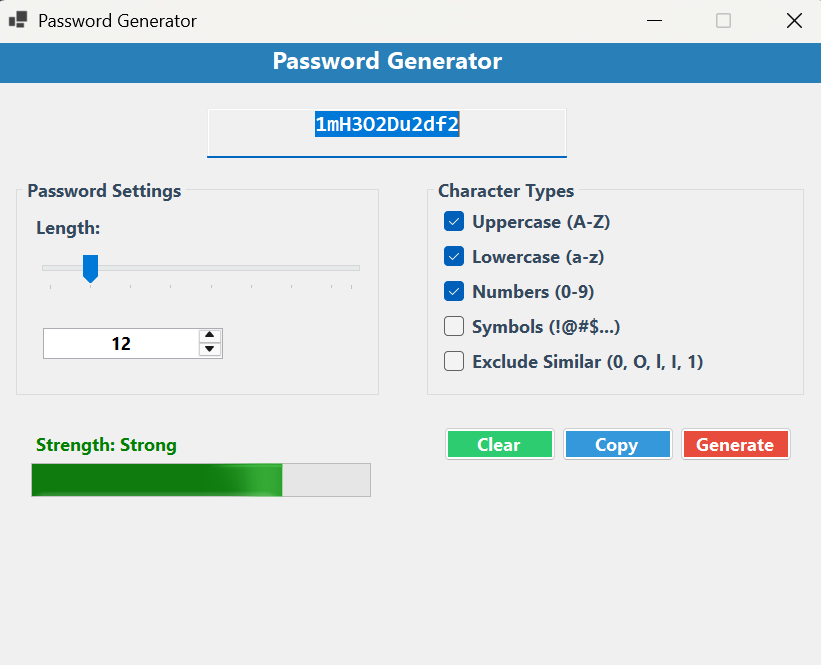

# 🔐 Password Generator

A secure and user-friendly desktop application for generating strong passwords, built with C# Windows Forms.


## 📸 Screenshots



## ✨ Features

### 🎯 Core Functionality
- **Cryptographically Secure**: Uses `RNGCryptoServiceProvider` for secure random generation
- **Customizable Length**: Generate passwords from 4 to 128 characters
- **Multiple Character Types**: Support for uppercase, lowercase, numbers, and symbols
- **Similar Character Exclusion**: Option to exclude confusing characters (0, O, l, I, 1)
- **Real-time Strength Indicator**: Visual feedback on password strength

### 🖥️ User Interface
- **Modern Design**: Clean and intuitive Windows Forms interface
- **Color-coded Strength**: Visual strength indicator with color progression
- **Interactive Controls**: Synchronized trackbar and numeric input
- **Clipboard Integration**: One-click copy to clipboard
- **Confirmation Dialogs**: Safe clear operation with user confirmation

### 🔒 Security Features
- **Cryptographic Random**: No pseudo-random vulnerabilities
- **Character Validation**: Ensures all selected character types are included
- **No Storage**: Generated passwords are not stored anywhere
- **Memory Safe**: Secure handling of sensitive data

## 🚀 Getting Started

### Prerequisites
- Windows OS (Windows 7 or later)
- .NET Framework 4.7.2 or later
- Visual Studio 2019+ (for development)

### Installation

1. **Clone the repository**
   ```bash
   git clone https://github.com/yourusername/password-generator.git
   cd password-generator
   ```

2. **Open in Visual Studio**
   ```bash
   # Open the solution file
   start password_gen.sln
   ```

3. **Build and Run**
   - Press `F5` or click the "Start" button in Visual Studio
   - Or build the solution and run the executable from `bin/Debug/` or `bin/Release/`

### Quick Start
1. Launch the application
2. Adjust password length using the slider or numeric input (4-128 characters)
3. Select desired character types:
   - ✅ Uppercase letters (A-Z)
   - ✅ Lowercase letters (a-z)
   - ✅ Numbers (0-9)
   - ⬜ Symbols (!@#$%^&*...)
   - ⬜ Exclude similar characters
4. Click **Generate** to create a new password
5. Click **Copy** to copy password to clipboard
6. Use **Clear** to remove the current password

## 🎮 Usage

### Password Configuration
```
Length: 4-128 characters (default: 12)
Character Types:
├── Uppercase (A-Z) ✓
├── Lowercase (a-z) ✓  
├── Numbers (0-9) ✓
├── Symbols (!@#$%^&*()_+-=[]{}|;:,.<>?) ⬜
└── Exclude Similar (0,O,l,I,1) ⬜
```

### Strength Levels
- 🔴 **Weak** (0-29): Short passwords or limited character types
- 🟠 **Medium** (30-69): Decent length with some variety
- 🟢 **Strong** (70-100): Long passwords with multiple character types

## 🏗️ Project Structure

```
password_gen/
├── Form1.cs              # Main application logic
├── Form1.Designer.cs     # UI design and layout
├── Program.cs           # Application entry point
├── password_gen.csproj  # Project configuration
└── README.md           # This file
```

### Key Components

- **Form1.cs**: Contains the main application logic including:
  - Password generation algorithm
  - Strength calculation
  - Event handlers
  - Security implementations

- **Form1.Designer.cs**: UI components and layout:
  - Panel layouts and styling
  - Control positioning and properties
  - Event binding

## 🛠️ Technical Details

### Algorithms
- **Random Generation**: `RNGCryptoServiceProvider` for cryptographic security
- **Strength Calculation**: Multi-factor scoring based on length and character diversity
- **Character Set Building**: Dynamic character set construction based on user preferences

### Security Considerations
- Uses cryptographically secure random number generation
- No password storage or logging
- Secure memory handling
- Input validation and sanitization

### Performance
- Lightweight application (~1MB)
- Instant password generation
- Minimal memory footprint
- Responsive UI with real-time updates

## 🤝 Contributing

Contributions are welcome! Here's how you can help:

1. **Fork the repository**
2. **Create a feature branch**
   ```bash
   git checkout -b feature/amazing-feature
   ```
3. **Commit your changes**
   ```bash
   git commit -m 'Add some amazing feature'
   ```
4. **Push to the branch**
   ```bash
   git push origin feature/amazing-feature
   ```
5. **Open a Pull Request**

### Development Guidelines
- Follow C# coding conventions
- Add comments for complex logic
- Test thoroughly before submitting
- Update documentation as needed

## 📋 Roadmap

- [ ] **Password History**: Optional secure storage of generated passwords
- [ ] **Export Features**: Save passwords to encrypted files
- [ ] **Password Strength Rules**: Customizable strength requirements
- [ ] **Themes**: Dark/Light mode support
- [ ] **Portable Version**: No-install executable
- [ ] **Multi-language Support**: Internationalization
- [ ] **Password Manager Integration**: API for popular password managers

## 🐛 Known Issues

- None currently reported

## 📝 Changelog

### Version 1.0.0 (2025-09-02)
- Initial release
- Basic password generation functionality
- Character type selection
- Strength indicator
- Clipboard integration
- Modern UI design

## 📄 License

This project is licensed under the MIT License - see the [LICENSE](LICENSE) file for details.

## 👨‍💻 Author

**[Your Name]**
- GitHub: [@Dialius](https://github.com/Dialius)

## 🙏 Acknowledgments

- SMK Telkom Purwokerto for the educational foundation
- Microsoft for the excellent Windows Forms framework
- The open-source community for inspiration

## 🔗 Related Projects

- [Password Strength Checker](https://github.com/example/password-checker)
- [Secure Random Generator](https://github.com/example/secure-random)
- [Windows Forms Utilities](https://github.com/example/winforms-utils)

---

⭐ **Star this repository if you find it useful!**

---

<div align="center">
  Made with ❤️ for secure password generation
</div>
